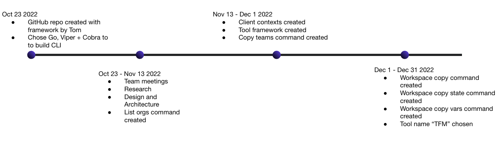
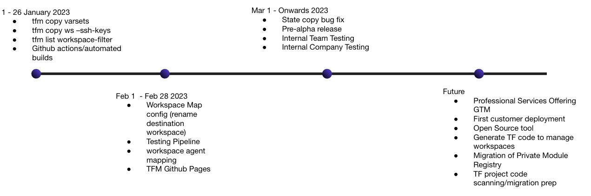

# History

In between engagments, across variouble global timezones, the IS team asynchronysly worked on developing a MVP of `tfm`. 

!!! note ""
    Note: The IS Team had to learn Go and other toolsets as we all come from a sys admin and infrastructure engineer background. It has been a massive mind shift and challenge for the group that have embarked on this project. 

## MVP Pre-Alpha Release

Our MVP allows a customer to:

- Migrate Workspaces 1 to 1 from source to destination
- Migrate Workspace settings
- Migrate Workspace States
- Migrate Workspace Variables and Variable Sets
- Migrate Workspace Team Access and Permissions
- Assign VCS connections to Destination Workspaces based on a Map provided in the config file 

## Future Work and Roadmap

!!! warning ""
    Note: We are looking for internal Beta testers to validate the migration process and provide feedback on scenarios our customers may encounter when migrating from TFE to TFC. 

    Please reach out to one of our listed [contact methods](#contacts) to get involved.

Depending on time and pipeline, we do hope we can continue to progress this project to provide value to our customers. 

Check out our [Github Projects page](https://github.com/orgs/hashicorp-services/projects/6).

Got an idea for a feature to `tfm`? Submit a [feature request](https://github.com/hashicorp-services/tfm/issues/new?assignees=&labels=&template=feature_request.md&title=)! 

