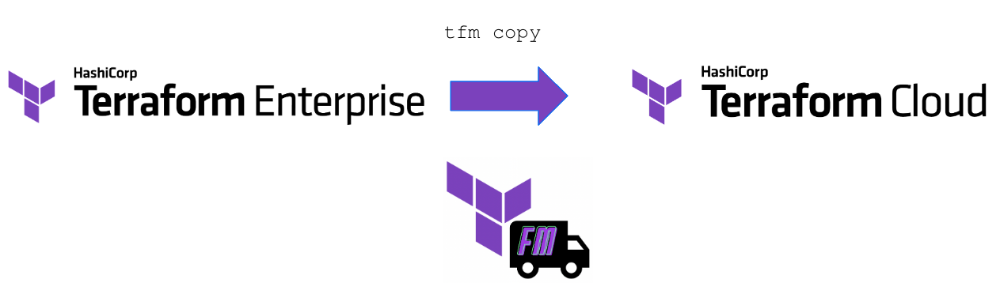

# Copy



Copy or Migrate, this sub commands takes X from source organization and copies (or migrates) it to the destination organization.

```sh
# tfm copy -h

Copy objects from Source Organization to Destination Organization

Usage:
  tfm copy [command]

Available Commands:
  teams       Copy Teams
  varsets     Copy Variable Sets
  workspaces  Copy Workspaces

Flags:
  -h, --help   help for copy

Global Flags:
      --config string   Config file, can be used to store common flags, (default is ./.tfm.hcl).

Use "tfm copy [command] --help" for more information about a command.
```

## Copy sub commands

- [`tfm copy teams`](copy_teams.md)
- [`tfm copy varsets`](copy_varsets.md)
- [`tfm copy workspaces`](copy_workspaces.md)

## Possible Future copy commands enhancements

- `tfm copy modules`
- `tfm copy policy-sets`
- `tfm copy workspace --all`

Got an idea for a feature to `tfm`? Submit a [feature request](https://github.com/hashicorp-services/tfm/issues/new?assignees=&labels=&template=feature_request.md&title=)!
