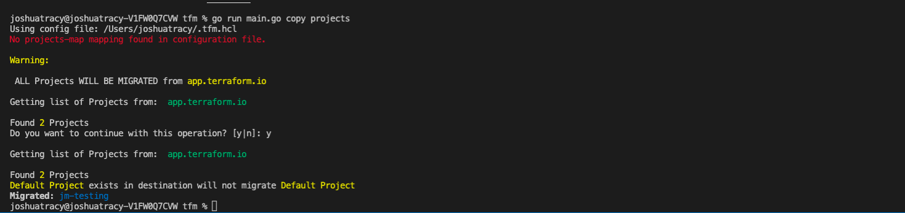

# tfm copy projects

`tfm copy projects` will take source organization projects and create them in the destination organization.



## Copy ALL projects

`tfm copy projects` will copy all source projects and create them in the destination organization.

Users will be required to confirm all projects is the desired operation if no `projects` list or `projects-map` map is not found in tfm config file (eg `~/.tfm.hcl`).

To automate the confirmation, the flag `--autoapprove=true` can be provided during a `tfm` run.

## Copy a list of projects

As part of the HCL config file (`/home/user/.tfm.hcl`), a list of projects from the source TFE can be specified. `tfm` will use this list when running `tfm copy projects` and ensure the project exists or is created in the target.

``` terraform
#List of projects to create/check are migrated across to new TFC
"projects" = [
  "appAFrontEnd",
  "appABackEnd",
  "appBDataLake",
  "appBInfra"
]

```

## Rename projects in destination during a copy

As part of the HCL config file (`/home/user/.tfm.hcl`), a list of `source-project-name=destination-project-name` can be provided. `tfm` will use this list when running `tfm copy project` to look at all projects in the source host and rename the destination project name.

!!! note ""
    *NOTE: Using the 'projects-map' configuration in your HCL config file will take precedence over the other 'projects' list feature which only lists source project names.*

```terraform
# A list of source=destination project names. TFM will look at each source project and recreate the project with the specified destination name.
"projects-map"=[
  "projectA=NewProjectA",
  "projectZ=NewProjectX"
]
