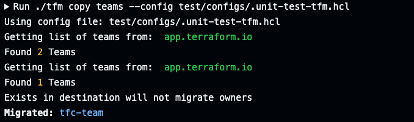

# tfm copy teams

`tfm copy teams` will take source organization teams and create them in the destination organization. 




## Organization to Project Migration

Additional option added to the command line, where permissions will be scaled back on the organizational level --- essentially read-only. Primary use case is when collapsing many organizations into a single organization with many projects.
This does not set the permissions on a project, only copying over the teams to give them access to the new organization. 
Project specific permissions will need to be set after the migration. 

`tfm copy teams --org-to-project`

```
tfm copy teams --org-to-project
Using config file: tfm/.tfm.hcl
Getting list of teams from:  tfe.source.io
Found 4 Teams
Getting list of teams from:  tfe.destination.io
Found 1 Teams
Migrating with read-only access accepted-bat-admin
Migrating with read-only access accepted-bat-power
Migrating with read-only access accepted-bat-reader
Exists in destination will not migrate owners
Created team in destination organization: accepted-bat-admin
New ID:                                   team-Q73TX3Td5RxXoRtU
Created team in destination organization: accepted-bat-power
New ID:                                   team-LB3cjrHcKFHuqMUm
Created team in destination organization: accepted-bat-reader
New ID:                                   team-jwQymP7pP2R6ThWg
```