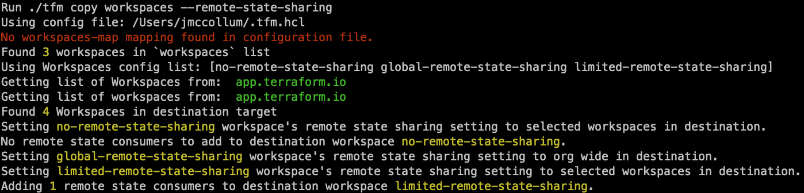
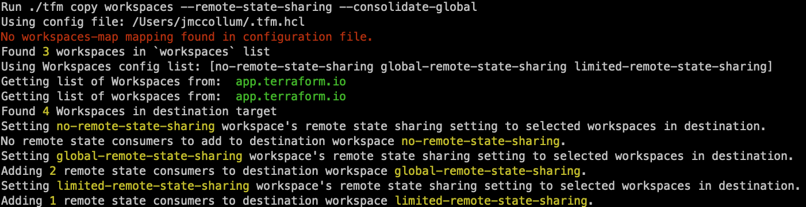

# tfm copy workspaces ----remote-state-sharing

`tfm copy workspaces --remote-state-sharing` is used to set the remote state sharing setting on a workspace.

This flag is designed for users that want to copy the workspace state sharing setting to the workspaces in the destination.

A workspace can be configured to share the state org wide or to selected workspaces. By default a workspace is set to being shared to selected workspaces, with no workspaces added.
This flag will go through each workspace on the source organization, check the state sharing setting, and on the destination workspace configure it to be shared org wide, shared to selected workspaces with no workspaces added or shared to selected workspaces, with adding workspaces with matching names from the source workspace to the destination workspace.

There is a limitation as of now, that the workspaces can't be changing names between the source and destination.
For example:
Workspace "networking" is shared with workspaces "app-1", "app-2", "app-3" in the source organization. When this flag is used, the tfm will lookup the workspace names that are shared, "app-1", "app-2", "app-3" and lookup all workspaces in the destination "app-1", "new-app-2", "app-3", "app-4", etc, and filter that list of all workspaces in the destination with the names "app-1", "app-2", "app-3" that it found in the source. tfm will then add "app-1", and "app-3" on the destination workspace sharing, as it wasn't able to find "app-2" which was renamed. If this is a blocker for your migration, please open an issue.

# tfm copy workspaces ----remote-state-sharing --consolidate-global

There is one additional flag that can be used with `--remote-state-sharing` which is `--consolidate-global`

This flag is to be used for companies that are doing an organization consolidation with their migration. For example, a company running TFE may have 10 orgs each with 10 workspaces, but in HCP Terraform they will have 1 orginzation with 100 workspaces. In one of the source orgs, they have 1 workspace that is shared with 9 other workspaces. When tfm migrates this workspace state sharing setting, in the destination org, that workspace would then be shared with 99 workspaces instead of just 9.

The `--consolidate-global` flag is designed to prevent this from happening. For workspaces that are shared with no workspaces or shared with a list of workspaces that functionality is unchanged from above. However if a workspace is shared org wide tfm will behave differently and perform the following step:

1. tfm will first set the destination workspace to being shared with selected workspaces only
2. List all workspaces in the source org
3. List all workspaces in the destination org
4. Filter the two lists to only return workspaces that have the same name as workspaces from the source org
5. Set that returned list of workspaces to be shared on the workspace in the destination org.

This will result in the workspaces that are being shared org wide in the source org to only being shared with selected workspaces in the destination org and prevent the oversharing of the state with workspaces that shouldn't be accessing the state. This does have the same limitation as above, in that the workspaces in the source org and destination org must have the same name. If this is a blocker for your migration, please open an issue.
