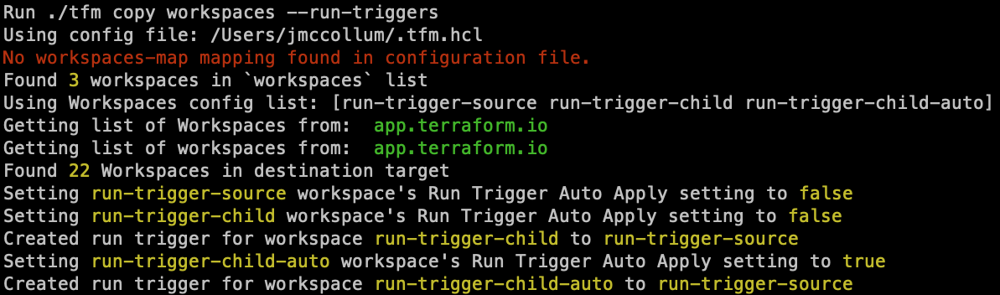

# tfm copy workspaces --run-triggers

`tfm copy workspaces --run-triggers` is used to copy run triggers that have been configured on a source workspace to the destination workspace.

A workspace can be configured so that when one or more source workspaces have a successful apply of runs, this will trigger a new run in this workspace. By default it will only do an automatic plan that will require confirmation before applying, however the Auto-apply run triggers can be enabled so it will automatically apply a run if changes are detected.

There is a limitation as of now, that the workspaces can't be changing names between the source and destination.
For example:
Workspace "app-1" is configured to have a run trigger from a workspace named "networking". When this flag is used, tfm will lookup the workspace names that have run triggers assigned on the "app-1" workspace. It will then on the migrated "app-1" workspace in the destination try and create a run trigger for the "app-1" workspace linked to a workspace named "networking" in the destination environment. If the "network" workspace is named differently in the destination tfm won't be able to find a matching workspace and won't create the run trigger
