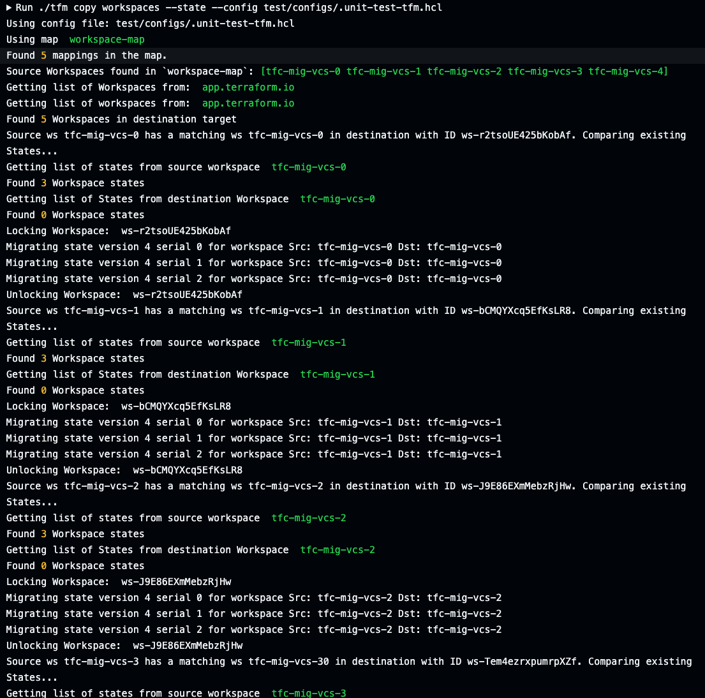
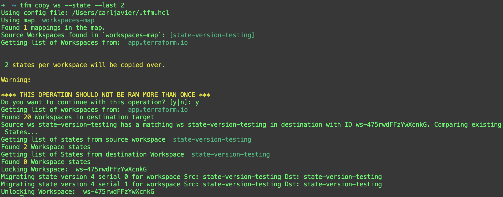

# tfm copy workspaces --state

`tfm copy workspaces --state` or `tfm copy ws --state` copies a workspaces' states from source to destination org.

In the event a state file encounters an error when attempting to migrate, TFM will stop migrating state files for that particular workspace and move to the next workspace.

# tfm copy workspaces --state --last X

`tfm copy workspaces --state --last X` or `tfm copy ws --state --last X` copies the last X number of workspaces' states from source to destination org.

This flag is designed for users who only want to copy the last X number of states from a workspace.

!!! WARNING ""
    **WARNING: This operation should not be ran more than once**

In the event a state file encounters an error when attempting to migrate, TFM will stop migrating state files for that particular workspace and move to the next workspace.

