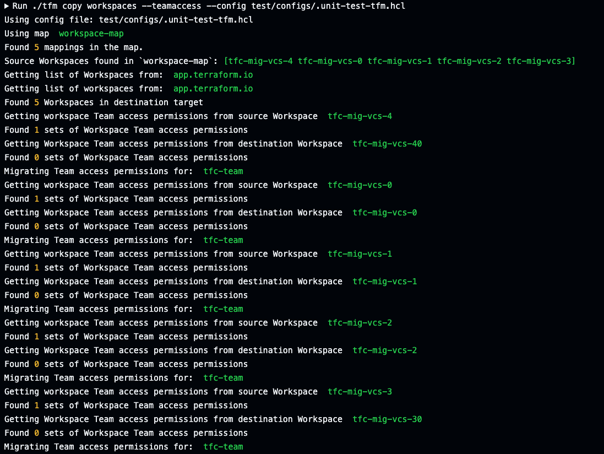

# tfm copy workspaces --teamaccess

`tfm copy workspaces --teamaccess` or `tfm copy ws --teamaccess` copies a workspaces' team access from source to destination org.

!!! warning ""
    *NOTE: Teams must exist in the destination.*

