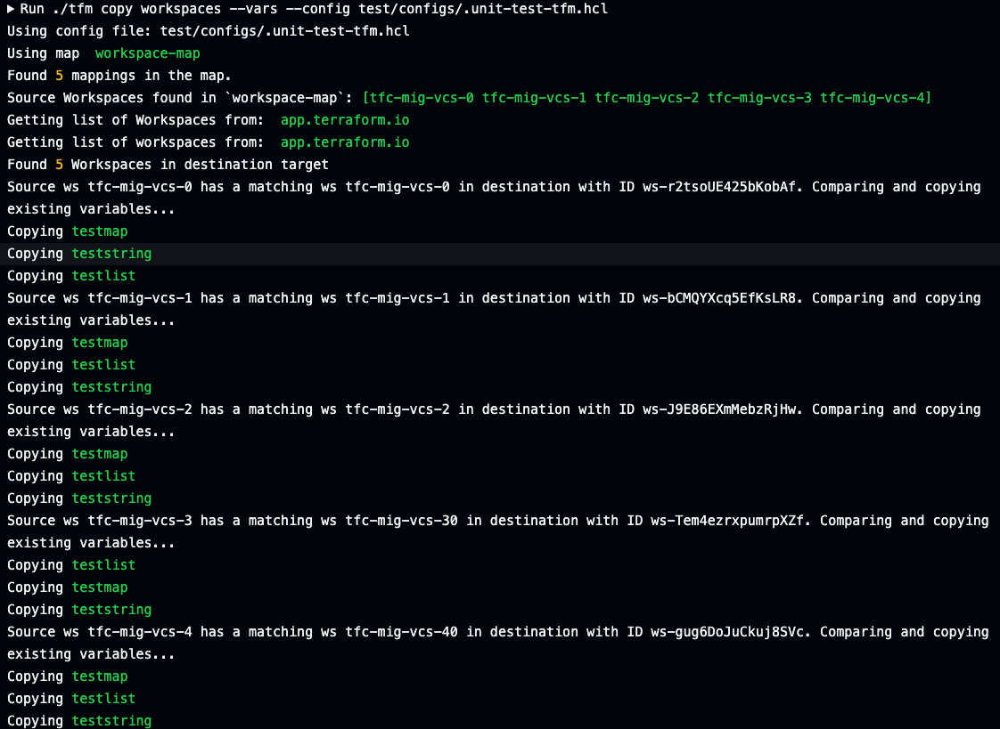

# tfm copy workspaces --vars

`tfm copy workspaces --vars` or `tfm copy ws --vars` copies a workspaces' variables from source to destination org.

!!! note ""
    *NOTE: Any sensitive variables will ONLY be created in the destination. These values will need to be populated*

