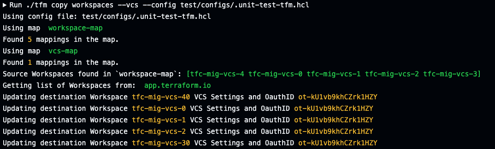

# tfm copy workspaces --vcs

`tfm copy workspaces --vcs` or `tfm copy ws --vcs` assigns a vcs' from source to destination org.

!!! note ""
    *NOTE: A vcs mapping must be provided in TFM's*

As part of the HCL config file (`/home/user/.tfm.hcl`), a list of `source-vcs-oauth-ID=destination-vcs-oauth-id-ID` can be provided. `tfm` will use this list when running `tfm copy workspaces --vcs` to look at all workspaces in the source host with the assigned source VCS oauth ID and assign the matching named workspace in the destination with the mapped destination VCS oauth ID.

```terraform
# A list of source=destination VCS oauth IDs. TFM will look at each workspace in the source for the source VCS oauth ID and assign the matching workspace in the destination with the destination VCS oauth ID.
vcs-map=[
  "ot-5uwu2Kq8mEyLFPzP=ot-coPDFTEr66YZ9X9n",
  "ot-gkj2An452kn2flfw=ot-8ALKBaqnvj232GB4",
]
```


