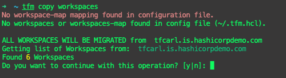
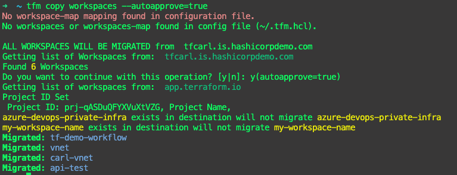
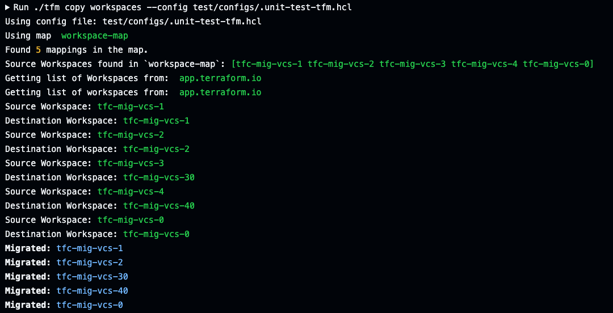
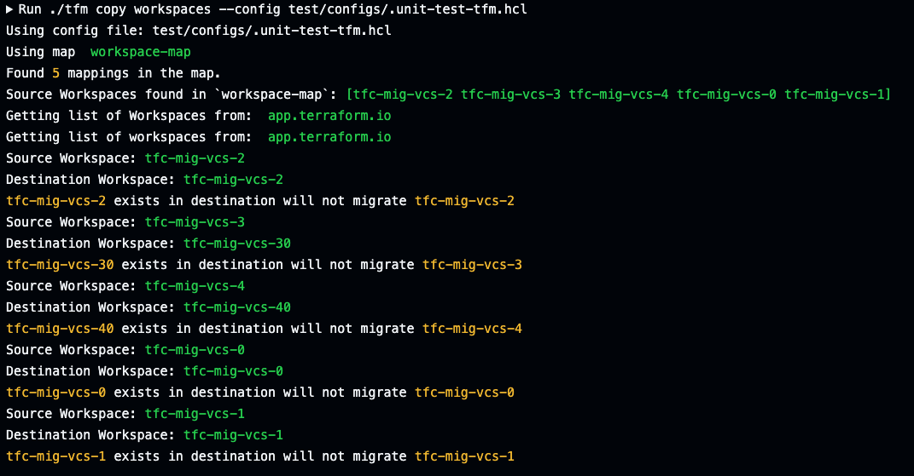

# tfm copy workspaces

`tfm copy workspaces` or `tfm copy ws` creates a workspaces from source to destination org.

After the workspaces are created at the destination, the next step is to copy the rest of the workspaces settings such as [state](copy_workspace_state.md), [variables](copy_workspace_variables.md), [team access](copy_workspace_teamaccess.md), [remote state sharing](copy_workspace_remote_state_sharing.md) etc using `tfm copy workspace` flags.  

`tfm copy workspaces -h`

```bash
Copy Workspaces from source to destination org

Usage:
  tfm copy workspaces [flags]

Aliases:
  workspaces, ws

Flags:
      --agents                 Mapping of source Agent Pool IDs to destination Agent Pool IDs in config file
      --consolidate-global     Consolidate global remote state sharing settings. Must be  used with --remote-state-sharing flag
  -h, --help                   help for workspaces
  -l, --last int               Copy the last X number of state files only.
      --lock                   Lock all source workspaces
      --remote-state-sharing   Copy remote state sharing settings
      --skip-sensitive-vars    Skip copying sensitive variables. Must be used with --vars flag
      --ssh                    Mapping of source ssh id to destination ssh id in config file
      --state                  Copy workspace states
      --teamaccess             Copy workspace Team Access
      --unlock                 Unlock all source workspaces
      --vars                   Copy workspace variables
      --vcs                    Mapping of source vcs Oauth ID to destination vcs Oath in config file
      --workspace-id string    Specify one single workspace ID to copy to destination

Global Flags:
      --config string   Config file, can be used to store common flags, (default is ./.tfm.hcl).
```

## Copy ALL workspaces

Without providing any flags, `tfm copy workspaces` will copy all source workspaces and create them in the destination organization.

Users will be required to confirm all workspaces is the desired operation if no `workspaces` or `workspaces-map` is not found in tfm config file (eg `~/.tfm.hcl`).



To automate the confirmation, the flag `--autoapprove=true` can be provided during a `tfm` run.



## Copy a list of workspaces

As part of the HCL config file (`/home/user/.tfm.hcl`), a list of workspaces from the source TFE can be specified. `tfm` will use this list when running `tfm copy workspaces` and ensure the workspace exists or is created in the target.

``` terraform
#List of Workspaces to create/check are migrated across to new TFC
"workspaces" = [
  "appAFrontEnd",
  "appABackEnd",
  "appBDataLake",
  "appBInfra"
]

```

## Rename Workspaces in destination during a copy

As part of the HCL config file (`/home/user/.tfm.hcl`), a list of `source-workspace-name=destination-workspace-name` can be provided. `tfm` will use this list when running `tfm copy workspace` to look at all workspaces in the source host and rename the destination workspace name.

!!! note ""
    *NOTE: Using the 'workspaces-map' configuration in your HCL config file will take precedence over the other 'workspaces' list feature which only lists source workspace names.*

```terraform
# A list of source=destination workspace names. TFM will look at each source workspace and recreate the workspace with the specified destination name.
"workspaces-map"=[
  "tfc-mig-vcs-0=tfc-mig-vcs-0",
  "tfc-mig-vcs-1=tfc-mig-vcs-1",
  "tfc-mig-vcs-2=tfc-mig-vcs-2",
  "tfc-mig-vcs-3=tfc-mig-vcs-30",
  "tfc-mig-vcs-4=tfc-mig-vcs-40",
]s
```



## Existing Workspaces in Destination

Any existing workspaces in the destination will be skipped.



## Copy Workspaces into Projects

By default, a workspace will be copied over to the Default Project in the destination (eg TFC).
Users can specify the project ID for the desired project to place all workspaces in the `tfm copy workspace` run.

Utilize [`tfm list projects --side destination`](../commands/list_projects.md#side-flag) to determine the `project id`.

Set either the environment variable:

```bast
export DST_TFC_PROJECT_ID=prj-XXXX
```

or specify the following in your `~/.tfm.hcl` configuration file.

```terraform
dst_tfc_project_id=prj-xxx 
```
