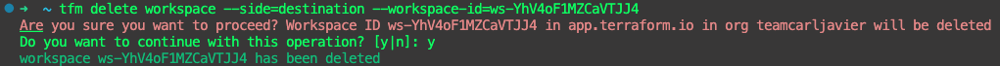
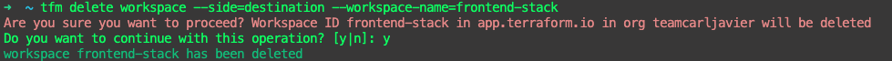
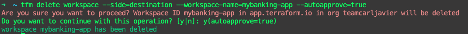

# tfm delete workspace

`tfm delete workspace` will delete Workspace in an org

## `--workspace-id` flag

## `--workspace-name` flag

## `--side` flag

Providing the `--side=destination` or `--side=source`flag will delete the workspace of the destination TFE/TFC instance.

## `--autoapprove` flag

