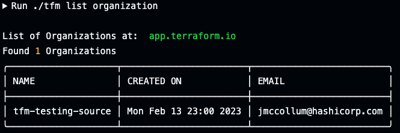
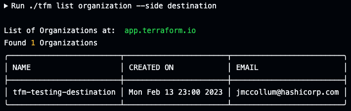

# tfm list organization

`tfm list organization` will list organization teams by default of the source TFE/TFC instance.
`tmf list org` is also the shorthand command.

## `--side` flag
Providing the `--side destination` flag will list organizations of the destination TFE/TFC instance.

