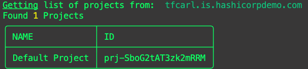
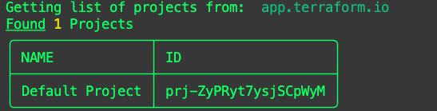

# tfm list projects

`tfm list projects` will list projects by default of the source TFE/TFC instance.

## `--side` flag
Providing the `--side destination` flag will list projects of the destination TFE/TFC instance.

!!! warning ""
    Note: Projects is a relatively new feature. If the source or destination TFE API endpoint does not support projects, `tfm` will error out. 
