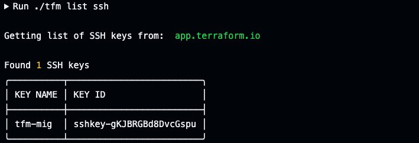
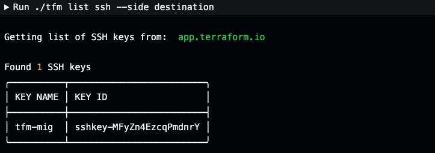

# tfm list ssh

`tfm list ssh` will list ssh keys teams by default of the source TFE/TFC instance.

## `--side` flag
Providing the `--side destination` flag will list ssh keys of the destination TFE/TFC instance.

