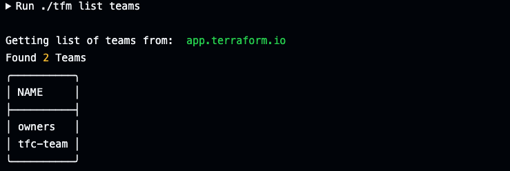
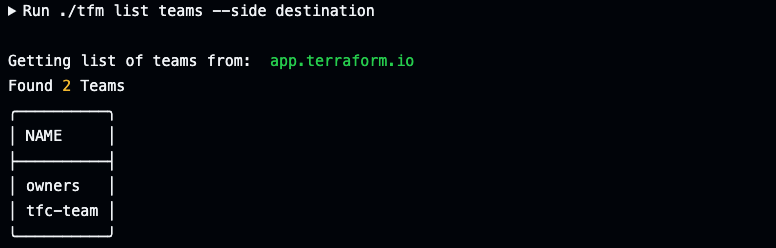

# tfm list teams

`tfm list teams` will list teams keys teams by default of the source TFE/TFC instance.

## `--side` flag
Providing the `--side destination` flag will list teams keys of the destination TFE/TFC instance.

