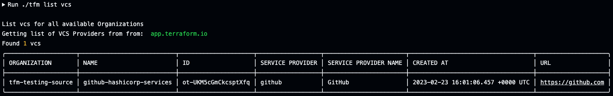
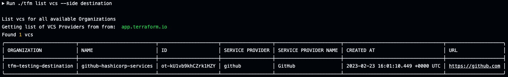

# tfm list vcs

`tfm list vcs` will list vcs keys teams by default of the source TFE/TFC instance.

## `--side` flag
Providing the `--side destination` flag will list vcs keys of the destination TFE/TFC instance.

