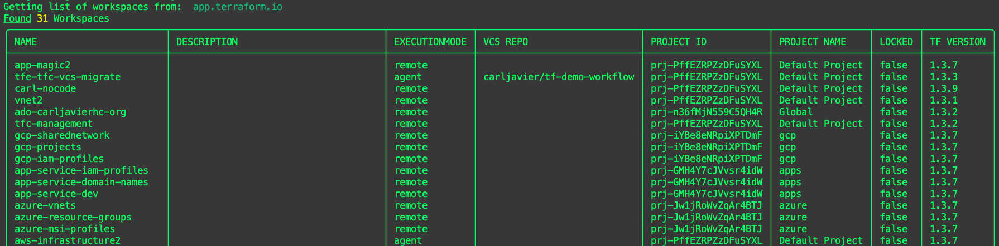

# tfm list workspaces

`tfm list workspaces` will list workspaces by default of the source TFE/TFC instance.

## `--side` flag
Providing the `--side destination` flag will list workspaces of the destination TFE/TFC instance.

