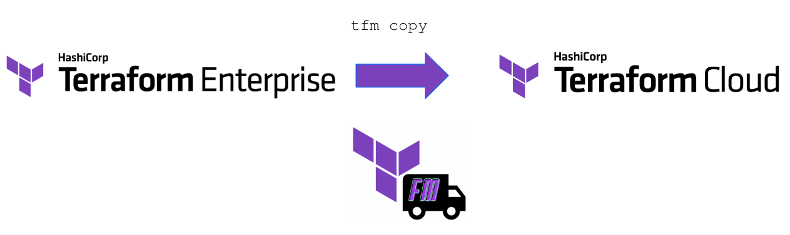

# Exmple Scenario with TFM



## Happy Path Scenario

Customer has been running Terraform Enterprise and has decided to move to Terraform Cloud. As part of choosing to buy than build their tools, they are embarking on using as many tools as a service. Terraform Cloud is one of them. 

### VCS
They have already migrated or starting using a Version Control System (VCS) in the cloud (eg Github, Gitlab or Azure DevOps). 

Teams are in the process of migrating off an on premesis VCS and into a cloud VCS. A goal is for all TFC workspaces to be backed by the new cloud VCS. 


### Identity Provider (SSO)
For their Identity Provider, they already utilise Azure AD with TFE. 

### TFE Organization

Customer has only one organization in their TFE. No consolidation of organizations is required when migrating to one TFC organization.

### TFE Workspaces
The following is a list of workspaces that have been targetted for initial migrations. 

<Insert list of workspaces from CLI tool OR screenshot Workspaces from TFE UI>


A suitable workspace for migration has the following requirements:

- A clean Terraform Plan with no changes has been ran recently.
- Terraform Version of the workspace is at least 0.13.x above
- Any Workspace variables that are secrets can be regenerated or retrieved to be assigned in the destination workspace.


### Preparing the destination (TFC organization)

In preparation of TFC, the following are completed to prepare for migration:

- GitHub connected as a [VCS provider](https://developer.hashicorp.com/terraform/cloud-docs/vcs/github-app)
- [Agent Pools](https://developer.hashicorp.com/terraform/cloud-docs/agents) created and connected to TFC
    - Certain workspaces require the use of Cloud Agents
- [Variable Sets](https://developer.hashicorp.com/terraform/tutorials/cloud/cloud-multiple-variable-sets) created in TFC to mimic what was configured in TFE.
    - *Optional*: use `tfm copy varsets`
    - New secrets have been regenerated for certain Variable Sets.
- [Azure AD SSO](https://developer.hashicorp.com/terraform/cloud-docs/users-teams-organizations/single-sign-on/azure-ad) integration setup
    - *Optional*: use `tfm copy teams` if TFC teams will be the same teams from TFE.


### Setting up the customer's TFM config file

The following is what a `~/.tfm.hcl` file will look like for `tfm copy workspaces` to use.
```hcl
#List of Workspaces to create/check are migrated across to new TFC
"workspaces" = [
  "api-test",
  "tf-demo-workflow",
  "azure-deveops-private-infra"
]

# A list of source=destination agent pool IDs TFM will look at each workspace in the source 
# for the source agent pool ID and assign the matching workspace in the destination the 
# destination agent pool ID.
agents-map = [
  "apool-DgzkahoomwHsBHcJ=apool-vbrJZKLnPy6aLVxE",
  "apool-DgzkahoomwHsBHc3=apool-vbrJZKLnPy6aLVx4",
  "apool-DgzkahoomwHsB125=apool-vbrJZKLnPy6adwe3"
]
'
# A list of source=destination Variable Set IDs. TFM will look at each workspace 
# in the source for the source variable set ID and assign the matching workspace 
# in the destination with the destination variable set ID.
varsets-map = [
  "Azure-creds=New-Azure-Creds",
  "aws-creds2=New-AWS-Creds",
  "SourceVarSet=DestVarSet"
 ]

 # A list of source=destination VCS oauth IDs. TFM will look at each workspace in the source for the source VCS oauth ID and assign the matching workspace in the destination with the destination VCS oauth ID.
vcs-map=[
  "ot-5uwu2Kq8mEyLFPzP=ot-coPDFTEr66YZ9X9n",
]


```


### Migrate Teams

```
tfm copy teams
```


### Migrate Variable Sets

```
tfm copy varsets
```


### Migrate workspaces

```
tfm copy workspaces
```


### Migrate Workspace state

```
tfm copy workspaces --state
```


### Migrate Workspace Team Access

```
tfm copy workspaces --teamaccess
```

 

### Migrate Workspace Variables

```
tfm copy workspaces --vars
```


### Migrate Workspace VCS settings

```
tfm copy workspaces --vcs
```


