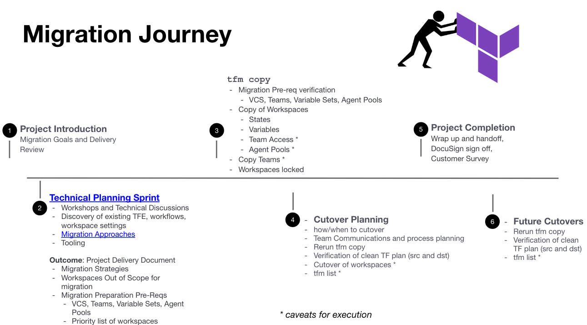

The above is an estimated customer experience when migrating TFE to TFC (or another TFE).
Offered and ran as a Fast Track offering, we run customer through a proven delivery methodolgy Implementation Services have been using to adopt other HashiCorp products.

---

## Technical Planning

Technical Planning Sprint (TPS) is a series of workshops to discuss and work through the technical requirements of a migration. Customer engineers and any technical hands on personal are encouraged to join these sessions to clarify what will be executed in the upcoming implementation sprint/s.

- Review necessary prerequisites and verify ability to execute the `tfm` tool within customer environment.
- Ascertain if individuals with appropriate access levels will be involved in the migration process
- Normal TFC configuration items (VCS, IdP, Terraform Cloud Agents) that will be covered
- Agents - Differences for on-prem deployments TFE vs. TFC.

## tfm copy

This phase introduces the `tfm` tool and demonstrates it capabilities. We plan to migrate the workspaces that were identified in technical planning. The following are the outcomes of this phase.

- Confirm Migration pre-requisites
  - VCS, Teams, Agent Pools, Workspace readiness
- Copy of Workspaces
  - States
  - Variables
  - Team Access *
  - Agent Pools *
- Copy Teams *
- Workspace locked in destination

## Cutover Planning

Migrating/Copying over workspaces into the destination TFC or TFE is easy with `tfm`, however there are other external dependencies and factors that need to be planned. Some examples of this are:

- When does each team cutover completely from using the older TFE workspaces and the new TFC workspaces.
- Does VCS repository need to be cutover or locked ?
- Verifying workspaces are Terraform planning cleanly (source and destination)
- Ensure the old TFE workspace cannot be updated or utilized by existing engineers/developers
- If there any updates to the source workspace state, re-run `tfm copy` to ensure the destination is up to date
- Using `tfm list` to verify workspaces that have been cut over/migrated
- Communication plan and lead time of cutover.

## Future Cutovers

There are times some workspaces cannot be migrated directly with `tfm` due to external factors. These workspaces may require future work to make it compatible to migrate to TFC or it is a timing and scheduling requirement.
